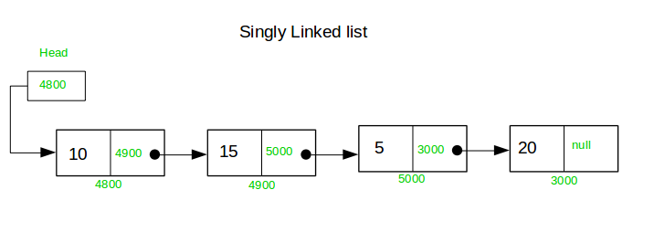
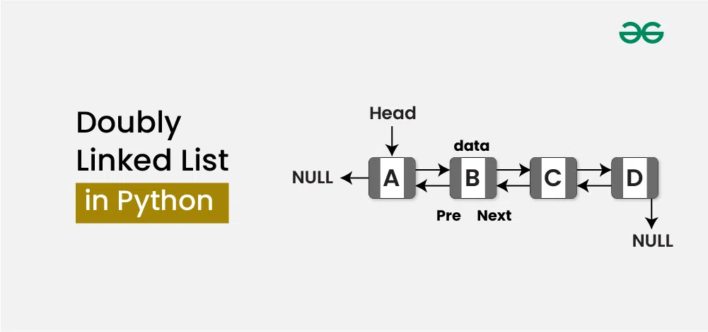
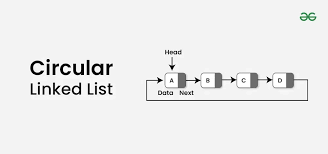
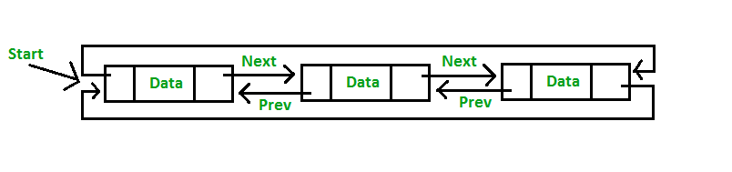

**1. What is a Linked List?**

A **Linked List** is a linear data structure where elements (called *nodes*) are connected using pointers.

Each node contains:
- **Data**: The value stored in the node.
- **Pointer/Reference**: The address of the next node in the list.

**Key characteristics:**
- Memory allocation is *not contiguous* (unlike arrays).
- Insertion and deletion operations are *easier* (no need to shift elements).
- Accessing elements is *slower* (must traverse nodes sequentially).

**2. Basic Structure of a Node**
- In C:
```c
struct Node {
    int data;
    struct Node* next;
};
```
- In Python:
```python
class Node:
    def __init__(self, data):
        self.data = data
        self.next = None
```
**3. Types of Linked Lists**
- **Singly Linked List**: Each node points to the next node.The last node points to NULL.

- **CODE in python**
- ```python
    class Node:
        # Initialize a new node with data and a pointer to the next node
        def __init__(self, data):
            self.data = data      # Store the value of the node
            self.next = None      # Initialize next as None (no next node yet)

        head = Node(10)               # Create the first node with data 10
        second = Node(20)             # Create the second node with data 20
        third = Node(30)              # Create the third node with data 30

        head.next = second            # Link first node to second node
        second.next = third           # Link second node to third node

        temp = head                   # Start traversal from the head node
        while temp:                   # Loop until the end of the list (when temp is None)
            print(temp.data, end=" -> ")  # Print the data of the current node
            temp = temp.next              # Move to the next node


- **Doubly Linked List**: Each node points to both the next and previous nodes

- ***Code in Python***
- ```python
    class DoublyNode:0
        def __init__(self, data):
            self.data = data
            self.next = None
            self.prev = None

        # Creating nodes
        head = DoublyNode(10)
        second = DoublyNode(20)
        third = DoublyNode(30)

        # Linking nodes
        head.next = second
        second.prev = head
        second.next = third
        third.prev = second

- **Circular Linked List**: The last node points back to the first node.
 - Types  in circular Linked List:
   - **Singly** Circular Linked List:
   -  
   - **Doubly** Linked List: 
   -  


# For more learning use this [Link](https://www.w3schools.com/dsa/dsa_data_linkedlists_types.php)