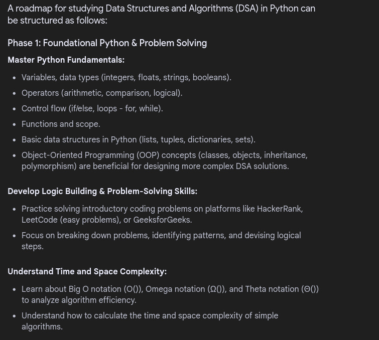
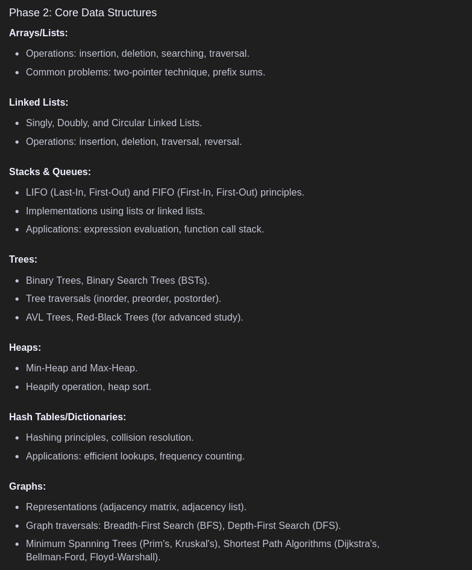
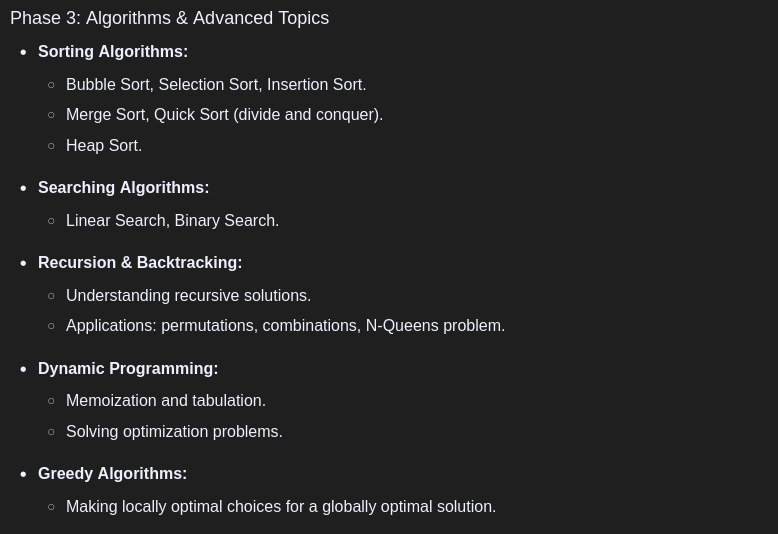

## Map-Dsa

- Click here for Fundamentals - [Python Fundamentals](https://www.w3schools.com/python/default.asp)
- Click here for OOps - [OOPS](/OOPS.md)
- Click here for map of Time Complexity - [Time Complexity](/Time_complesity.md)

- Array (array lib for OG array)- [Array](/array.ipynb)
- Linked Lists - [Linked List](/LinkedList.md)
- Problem Solving in LinkedList - [Problems](/LinkedListProblems.ipynb)
- Trees - [Trees](/Trees.ipynb)

- Sorting - [Sorting](/Sorting.ipynb)